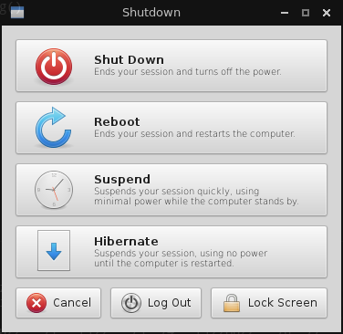

# pyshutdown
A simple Python + GTK app for restarting/shutting down a Linux machine

Was made way back when I started experimenting with personalizing my own desktop environment. Designed to emulate the GNOME shutdown dialog at the time (circa 2011).

Originally intended for Openbox, and other bare-bones window managers. Cobbled together from code found online.

The original code was found in the following forum post:
https://bbs.archlinux.org/viewtopic.php?pid=979060#p979060

Dependencies
* Python 3.x
* GTK 3.x
* DBus

Screenshot:

